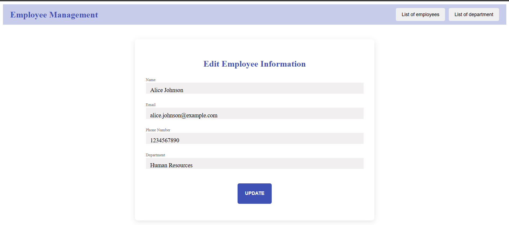

<h1 align="center">Employee Managemnt API</h1>

<p align="center">A Spring Boot RESTful API with an Angular@14 frontend.</p>

## Table of Contents
- [Features](#features) - [Endpoints](#endpoints)
- [Examples](#examples) - [Frontend](#frontend)
- [Interfaces](#interfaces)

## Features
- Create, Read, Update, Delete (CRUD) operations for Employees and Departments
- Employee-Department Relationship: Employees belong to a Department
- Pagination for Employee and Department listings 

## Endpoints                                                                                                                           | ADMIN only                       |
### DepartmentController Endpoints

| #   | URL                             | Http Method | Function                        | Description                                                                                                 |
|-----|---------------------------------|-------------|---------------------------------|-------------------------------------------------------------------------------------------------------------|
| 1   | /departments                    | POST        | Create a new department         | Department fields: Name, Description.                                                                        |
| 2   | /departments/{id}               | GET         | Return a department by ID       | Id is a path variable of a specific department in the DB.                                                     |
| 3   | /departments                    | GET         | Return the department list with pagination | Spring Pageable params for pagination and sorting.                                                           |
| 4   | /departments/{id}               | PUT         | Update a specific department    | Id is a path variable of a specific department in the DB, with fields to update (e.g., Name, Description).    |
| 5   | /departments/{id}               | DELETE      | Delete a specific department    | Id is a path variable of a specific department in the DB.                                                     |

### EmployeeController Endpoints

| #   | URL                             | Http Method | Function                        | Description                                                                                                 |
|-----|---------------------------------|-------------|---------------------------------|-------------------------------------------------------------------------------------------------------------|
| 1   | /employees                      | POST        | Create a new employee           | Employee fields: Name, Position, Department, Salary, etc.                                                     |
| 2   | /employees/{id}                 | GET         | Return an employee by ID        | Id is a path variable of a specific employee in the DB.                                                      |
| 3   | /employees                      | GET         | Return the employee list with pagination | Spring Pageable params for pagination and sorting.                                                           |
| 4   | /employees/{id}                 | PUT         | Update a specific employee      | Id is a path variable of a specific employee in the DB, with fields to update (e.g., Name, Position, Salary). |
| 5   | /employees/{id}                 | DELETE      | Delete a specific employee      | Id is a path variable of a specific employee in the DB.                                                      |


## Examples

### Add Department
```json
{
  "name": "Research and Development",
  "location": "Building G"
}
```

### Add Employee
```json
{
  "name": "Grace Lee",
  "email": "grace.lee@example.com",
  "phoneNumber": "789-012-3456",
  "departmentName": "Research and Development"
}
```

## Frontend
The frontend application is built using Angular@14 and styled with Angular Material to provide a clean, responsive, and professional user interface. The application includes components for:

- ** Employee Management**: Add, edit, and list employees
-  **Department Management**: Add, edit, and list departments
-  **API Integration**: The frontend communicates with the Spring Boot backend to perform CRUD operations on both Employee and Department entities

## Interfaces

### -Department
#### Department List


#### Add department


### -Employee
#### Employee List


### Pagination


### Edit Employee



